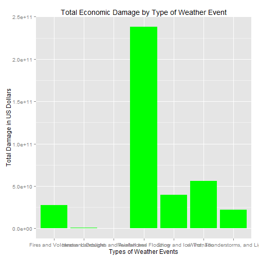

#Synopsis

This project explores data from the U.S. National Oceanic and Atmospheric Administration's storm database. The database includes information on major weather events in the United States, including location, event type, fatalities, injuries, property damage and damage to crops and spans the years 1950 to 2011. The purpose of this analysis was to answer two questions: 1. Across the United States, which types of events are most harmful with respect to population health? 2. Across the United States, which types of events have the greatest economic impact? 

#Data Processing

We begin by reading the raw data into R. 


```r
data <- read.csv("repdata-data-StormData.csv")
```

If we use the dim function, we'll see that this dataset includes 903,870 rows and 40 columns. Because this is a very large dataset, reducing its size will make it easier to work with. We can do this by isolating only those columns that will be necessary for analysis. 


```
##  [1] "STATE__"    "BGN_DATE"   "BGN_TIME"   "TIME_ZONE"  "COUNTY"    
##  [6] "COUNTYNAME" "STATE"      "EVTYPE"     "BGN_RANGE"  "BGN_AZI"   
## [11] "BGN_LOCATI" "END_DATE"   "END_TIME"   "COUNTY_END" "COUNTYENDN"
## [16] "END_RANGE"  "END_AZI"    "END_LOCATI" "LENGTH"     "WIDTH"     
## [21] "F"          "MAG"        "FATALITIES" "INJURIES"   "PROPDMG"   
## [26] "PROPDMGEXP" "CROPDMG"    "CROPDMGEXP" "WFO"        "STATEOFFIC"
## [31] "ZONENAMES"  "LATITUDE"   "LONGITUDE"  "LATITUDE_E" "LONGITUDE_"
## [36] "REMARKS"    "REFNUM"     "X"          "X.1"        "X.2"
```

##Question 1: Finding Harms to Human Health

Using unique(tidy.data$EVTYPE), we can immediately see that the event types have not been assigned consistently, which poses challenges for further analysis. So we're going to create a new column ("Cause") and some categories which will be based on terms found in the EVTYPE column. 


```r
tidy.data$EVTYPE <- tolower(tidy.data$EVTYPE) 
tidy.data[grepl("tornado|spout|funnel|whirlwind", tidy.data$EVTYPE), "Cause"] <- "Tornado" 
tidy.data[grepl("rain|flood|typhoon|high surf|tsunami|wet|shower|precipitation|waves", tidy.data$EVTYPE), "Cause"] <- "Rainfall and Flooding"
tidy.data[grepl("ice|snow|hail|blizzard|freezing|cold|wind chill|cool|frost|winter", tidy.data$EVTYPE), "Cause"] <- "Snow and Ice"
tidy.data[grepl("wind|thunderstorm|tstm|lightning", tidy.data$EVTYPE), "Cause"] <- "Wind, Thunderstorms, and Lightning"
tidy.data[grepl("fire|smoke|volcano|ash", tidy.data$EVTYPE), "Cause"] <- "Fires and Volcanoes"
tidy.data[grepl("warm|dry|heat|hot|summer", tidy.data$EVTYPE), "Cause"] <- "Heat and Drought"
tidy.data[grepl("landslide|avalanche", tidy.data$EVTYPE), "Cause"] <- "Landslides and Avalanches"
tidy.data <- tidy.data[complete.cases(tidy.data[, "Cause"]),] #remove cases that were not categorized
tidy.data$EVTYPE <- NULL #remove EVTYPE column
```

We can use the dim function to see how many lines we removed as a result of cleaning. Ideally, all EVTYPE contents would be categorized into the Cause column in order to have a more complete analysis. But, in this case, we now have 890,699 rows. We use the data in the Fatalities and Injuries columns to respond to the first question. Please note that the answer is in the Results section. 


```r
tidy.data$Fatalities <- as.numeric(as.character(tidy.data$Fatalities))
tidy.data$Injuries <- as.numeric(as.character(tidy.data$Injuries))
tidy.data <- tidy.data[complete.cases(tidy.data[, "Fatalities"]),]
tidy.data <- tidy.data[complete.cases(tidy.data[, "Injuries"]),]
fatalities <- aggregate(tidy.data$Fatalities, by=list(tidy.data$Cause), FUN=sum) #sum up the fatalities by cause using aggregate
injuries <- aggregate(tidy.data$Injuries, by=list(tidy.data$Cause), FUN=sum)
humans <- cbind(fatalities, injuries[, 2]) #combine fatalities and injuries data
colnames(humans) <- c("Cause", "Fatalities", "Injuries")
```

##Question 2: Finding the Economic Consequences

Next, we need to look at our columns showing damage (PROPDMG, PROPDMGEXP, CROPDMG, CROPDMGEXP). PROPDMGEXP and CROPDMGEXP refer to the order of magnitude (e.g., thousands, millions, billions) and are currently coded with letters which need to be replaced. 


```r
tidy.data$PROPDMGEXP <- tolower(tidy.data$PROPDMGEXP) 
tidy.data$CROPDMGEXP <- tolower(tidy.data$CROPDMGEXP) 
tidy.data$PROPDMGEXP[(tidy.data$PROPDMGEXP=="+") | (tidy.data$PROPDMGEXP=="-") | (tidy.data$PROPDMGEXP=="?")] <- 0
tidy.data$PROPDMGEXP[(tidy.data$PROPDMGEXP=="")] <- 1
tidy.data$PROPDMGEXP[(tidy.data$PROPDMGEXP=="1")] <- 10 
tidy.data$PROPDMGEXP[(tidy.data$PROPDMGEXP=="h")] <- 10^2
tidy.data$PROPDMGEXP[(tidy.data$PROPDMGEXP=="k")] <- 10^3
tidy.data$PROPDMGEXP[(tidy.data$PROPDMGEXP=="m")] <- 10^6
tidy.data$PROPDMGEXP[(tidy.data$PROPDMGEXP=="b")] <- 10^9
tidy.data$CROPDMGEXP[(tidy.data$CROPDMGEXP=="+") | (tidy.data$CROPDMGEXP=="-") | (tidy.data$CROPDMGEXP=="?")] <- 0
tidy.data$CROPDMGEXP[(tidy.data$CROPDMGEXP=="")] <- 1
tidy.data$CROPDMGEXP[(tidy.data$CROPDMGEXP=="1")] <- 10 
tidy.data$CROPDMGEXP[(tidy.data$CROPDMGEXP=="h")] <- 10^2
tidy.data$CROPDMGEXP[(tidy.data$CROPDMGEXP=="k")] <- 10^3
tidy.data$CROPDMGEXP[(tidy.data$CROPDMGEXP=="m")] <- 10^6
tidy.data$CROPDMGEXP[(tidy.data$CROPDMGEXP=="b")] <- 10^9
```

We can then use the cleaned data to calculate the total property damages and total damage to crops in new columns. 


```r
tidy.data$PROPDMGEXP <- as.numeric(tidy.data$PROPDMGEXP) #useful to check necessary conversion steps using str
tidy.data$CROPDMGEXP <- as.numeric(tidy.data$CROPDMGEXP)
tidy.data$PROPDMG <- as.numeric(as.character(tidy.data$PROPDMG))
tidy.data$CROPDMG <- as.numeric(as.character(tidy.data$CROPDMG))
tidy.data$Property <- tidy.data$PROPDMG * tidy.data$PROPDMGEXP
tidy.data$Crops <- tidy.data$CROPDMG * tidy.data$CROPDMGEXP
tidy.data$PROPDMG <- NULL
tidy.data$PROPDMGEXP <- NULL
tidy.data$CROPDMG <- NULL
tidy.data$CROPDMGEXP <- NULL #same as with the EVTYPE column, remove those that are no longer necessary
```

We then aggregate and organize the data. The answer, as well as visualization, are in Results. 


```r
library(ggplot2)
economics <- aggregate(Property + Crops ~ Cause, data=tidy.data, sum) #combine the Property and Crops columns by Cause
names(economics) <- c("Cause", "Damages")
economics <- economics[order(-economics$Damages),] #order the data to find the answer quickly
```

#Results

##Question 1. Across the United States, which types of events are most harmful with respect to population health?


```r
humans
```

```
##                                Cause Fatalities Injuries
## 1                Fires and Volcanoes       1125     3410
## 2                   Heat and Drought       3181     9272
## 3          Landslides and Avalanches        263      224
## 4              Rainfall and Flooding        834     8695
## 5                       Snow and Ice        880     7647
## 6                            Tornado       5599    90764
## 7 Wind, Thunderstorms, and Lightning       2269    16768
```

Tornadoes are the most harmful with respect to population health, having caused 5,599 fatalities and 90,764 injuries.

##Question 2. Across the United States, which types of events have the greatest economic consequences?


```r
economics
```

```
##                                Cause      Damages
## 4              Rainfall and Flooding 238268524550
## 6                            Tornado  56326619731
## 5                       Snow and Ice  39463425679
## 1                Fires and Volcanoes  27345586650
## 7 Wind, Thunderstorms, and Lightning  22074307314
## 2                   Heat and Drought    931552630
## 3          Landslides and Avalanches    353490800
```


```r
g <- ggplot(economics, aes(Cause, Damages))
g + geom_bar(stat="identity", fill="green") +
xlab("Types of Weather Events") +
ylab("Total Damage in US Dollars") +
ggtitle("Total Economic Damage by Type of Weather Event")
```

 

Rainfall and flooding have the greatest economic consequences, having caused $23,8268,524,550 worth of damage to property and crops. 
